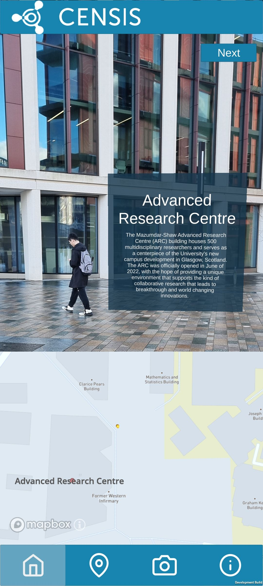

# CENSIS AR App - University of Glasgow Scavenger Hunt

## Description

The Glasgow University Scavenger Hunt leads you on a guided scavenger hunt through Glasgow University's stunning Gilmorehill Campus, using fun clues and Augmented Reality aids to help you find your way to some of the campus' iconic locations.

When you find a location, you can discover interesting insights about the location.

## Unity

The project is currently running Unity version [2022.3.16f1](https://unity.com/releases/editor/whats-new/2022.3.16) and targeting [.NET Framework 4.81](https://dotnet.microsoft.com/en-us/download/dotnet-framework/net481).

## Installing, Building and Running

To build and run the app on mobile devices, you must first install [Unity](https://unity.com/download), including its [AR Framework](https://unity.com/unity/features/arfoundation). From this point on, the steps for building and running differ depending on platform.

### Android

To build and run on Android devices, first ensure you have installed

* the latest version of Android
* the Android Build Support module for Unity
* the Android SDK for Unity [(SDK)](https://developer.android.com/studio#command-tools)
* the Native Development Kit [(NDK)](https://developer.android.com/ndk/)
* a Java development kit [(Unity uses OpenJDK)](http://openjdk.java.net/)

An easy way to do this is to install them through the Unity Hub as described [here](https://docs.unity3d.com/Manual/android-sdksetup.html).

#### Building Android from the Unity Editor GUI

Connect your device to your computer using a wired or wireless connection. You will need to enable developer mode on your Android device. The specific method to achieve this is device dependent, so please consult the relevant documentation for your device.

Once your device is connected and in developer mode, allow debugging on your device and open the folder {repo-root}/CENSIS-AR-App/ in the Unity Editor. Open the build and run menu, select 'Assets/Scenes/AppScene', select your device, and click build and run.

The app will then build and open automatically on your Android device.

#### Building Android from the command line

To build from the command line, you can run the following command from the repo root, replacing the Unity Editor path and your own custom names where you like.

**Powershell**

``` bash
&"C:/Program Files/Unity/Hub/Editor/2022.3.16f1/Editor/Unity.exe" -projectPath CENSIS-AR-App -quit -batchmode -nographics -buildTarget Android -customBuildTarget Android -customBuildName Build -customBuildPath Builds/Android/ -executeMethod BuildCommand.PerformBuild -logFile stdout
```

### IOS

#### Building IOS from the Unity Editor GUI

Using a Mac and an iPhone, ensure both devices are updated to the most recent software as previous versions may not be compatible. Then, if you do not have XCode installed simply visit the apple developer webpage and install the most recent version to your Mac. To finish preparing the device, navigate to the privacy settings on your iPhone and turn on developer mode.

Now, from Unity Hub you need to install the IOS package module before opening the folder {repo-root}/CENSIS-AR-App/ in the Unity Editor. To build the project, open the build setting and firstly switch the platform to IOS before checking the developer build setting and add the 'Assets/Scenes/AppScene'. Now click the build and run button and create a new folder name 'Builds' and XCode should be open upon completion.

Next in XCode, the code should begin compiling but before we can deploy we must first navigate to the Signing and Capabilities tab, check the Enable Automatic Signing box and create and assign your team following the pop ups from the drop down menu. Now Connect your phone to the mac (a cable is most appropriate) and ensure the correct device is selected on the top bar of XCode and press run. Finally navigate to the VPN and Device Management option in the phones general setting and trust the developer and you should be able to open the app from your home page.

If any issues are encountered please refer to documentation online or [this](https://www.youtube.com/watch?v=-Hr4-XNCf8Y&t=352s) YouTube video as a reference.

#### Building IOS from the command line

To build from the command line, you can run the following command from the repo root, replacing the Unity Editor path and your own custom names where you like.

**Powershell**

``` bash
&"C:/Program Files/Unity/Hub/Editor/2022.3.16f1/Editor/Unity.exe" -projectPath CENSIS-AR-App -quit -batchmode -nographics -buildTarget iOS -customBuildTarget iOS -customBuildName Build -customBuildPath Builds/IOS/ -executeMethod BuildCommand.PerformBuild -logFile stdout
```

Open the resulting file in XCode, the code should begin compiling but before we can deploy we must first navigate to the Signing and Capabilities tab, check the Enable Automatic Signing box and create and assign your team following the pop ups from the drop down menu. Now Connect your phone to the mac (a cable is most appropriate) and ensure the correct device is selected on the top bar of XCode and press run. Finally navigate to the VPN and Device Management option in the phones general setting and trust the developer and you should be able to open the app from your home page.

If any issues are encountered please refer to documentation online or [this](https://www.youtube.com/watch?v=-Hr4-XNCf8Y&t=352s) YouTube video as a reference.

## Example Images

An example of information text being displayed for the ARC Building on the UofG Gilmorehill Campus.



## Usage

### Using the App

The app requires permission to access your location and camera to function properly. If these are not granted, you will be warned and the app will not function as intended.

To visit a location, you must move to within a geofenced area which surrounds it. If you then look at the building, using the visual aids on the screen to help you find the right place to look, you will be able to read, and interact with, historical information about the location displayed using AR. In order to interact with the AR text you first need to tap it and then pinch to scale the text. You can also rotate it by performing a rotating motion with two fingers.

The app also contains a map to help you navigate around the area you're hunting in and keeps track of locations you've already visited, helping you get back to them if you want to read the information again.

### Adding new locations

See the Utils [readme](Utils/README.md) for more information.

## APIs

The app makes use of two APIs - [Open Weather Map](https://openweathermap.org/api) and [Mapbox](https://www.mapbox.com/unity).

The API token for OWM is stored within the [OpenWeatherMap.json](CENSIS-AR-App%2FAssets%2FResources%2FOpenWeatherMap.json) file.

The API token and configuration for Mapbox is stored in [MapboxConfiguration.txt](CENSIS-AR-App%2FAssets%2FResources%2FMapbox%2FMapboxConfiguration.txt).

### Modifying Mapbox configuration

If you wish to use your own API token, open the Unity project and navigate to the Mapbox tab at the top of the editor. From here you can access the configuration and input your API token.

(Tokens can be acquired by creating a Mapbox account [here](https://account.mapbox.com).)

## Licensing

See the [LICENSE](LICENSE) file for licensing information as it pertains to files in this repository.

## Acknowledgements

* [game-ci/docker](https://github.com/game-ci/docker) Copyright (c) 2020-present GameCI used under MIT License.
* [Mapbox Unity SDK](https://www.mapbox.com/unity) copyright (c) 2016-2017 Mapbox used under MIT License
* [SimpleJSON](https://github.com/Bunny83/SimpleJSON) Copyright (c) 2012-2022 Markus Göbel (Bunny83) used under MIT License
* [Feather](https://github.com/feathericons/feather) Copyright (c) 2013-2023 Cole Bemis used under MIT License
