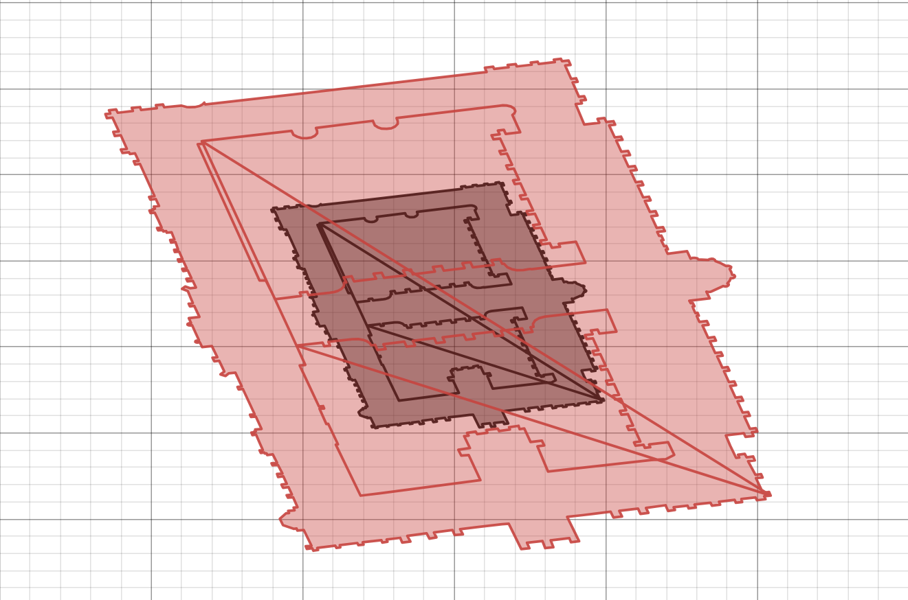

# CENSIS AR App - Utilities

## Adding Extra Locations

### Option 1 - LocationAdder executable (easiest option)

---

#### 1. Run Executable

Additional locations can be created and added to the scavenger hunt by running the `LocationAdder.exe` executable

#### 2. Fill in the form

You should now see a form prompting you for a building name, a clue, some information, an OpenStreetMaps location link,
and a outer boundary box scaling factor.

- You can find the link by going to [Open Street Map](https://www.openstreetmap.org/), and searching for the name of
your building. The link should be in the format `https://www.openstreetmap.org/way/<wayId>` or
`https://www.openstreetmap.org/relation/<relationID>`
- The outer boundary box scale refers to how far from the building you should be to view the information overlay. For
example, a scale factor of two on the Gilbert Scott building looks like this:

#### 3. Click Submit

Your location item should now have been saved to a text file named `Locations.txt`, you can now copy the contents of
this file into items list in the `LocationInformation.json`file found
at `CENSIS-AR-App/Assets/Resources/LocationInformation.json`.

### Option 2 - LocationAdder.py (More Flexible)

---

#### 1. Download the following dependencies

- [OSMPythonTools](https://wiki.openstreetmap.org/wiki/OSMPythonTools#Installation)
- [Tkinter](https://tkdocs.com/tutorial/install.html)
- [Shapely](https://shapely.readthedocs.io/en/latest/installation.html)

#### 2. Run the script

In the command line or an IDE of your choice, `run LocationAdder.py`

- **Command line**: navigate to the `Utils` and run `Python LocationAdder.py`.
- **IDE**: Open the Utils folder in any IDE, most will have a 'play' button, this will launch the file.

#### 3. Fill in the form

You should now see a form prompting you for a building name, a clue, some information, an OpenStreetMaps location link,
and a outer boundary box scaling factor.

- You can find the link by going to [Open Street Map](https://www.openstreetmap.org/), and searching for the name of
  your building. The link should be in the format `https://www.openstreetmap.org/way/<wayId>` or
  `https://www.openstreetmap.org/relation/<relationID>`
- The outer boundary box scale refers to how far from the building you should be to view the information overlay. For
  example, a scale factor of two on the Gilbert Scott building looks like this:
  

#### 4. Click Submit

Your location item should now have been saved to a text file named `Locations.txt`, you can now copy the contents of
this file into items list in the `LocationInformation.json`file found
at `CENSIS-AR-App/Assets/Resources/LocationInformation.json`.

(Note the locations in the JSON file must initially be visited in the order they appear in the JSON.)
